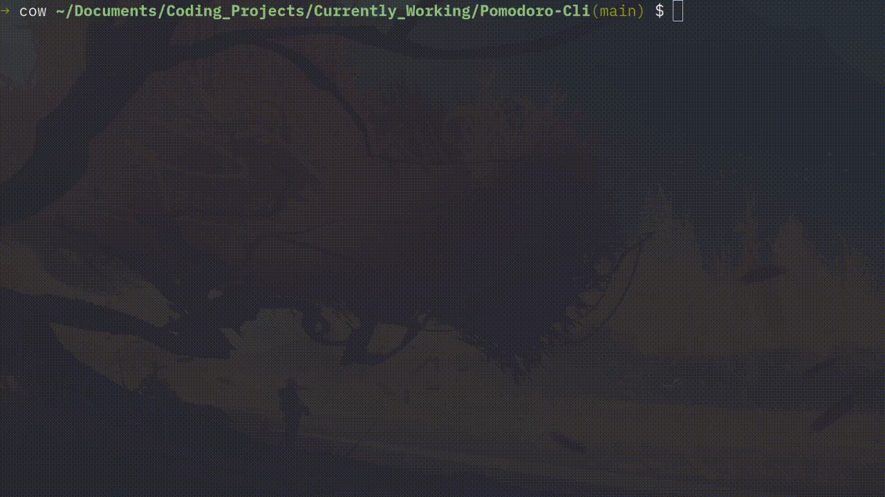
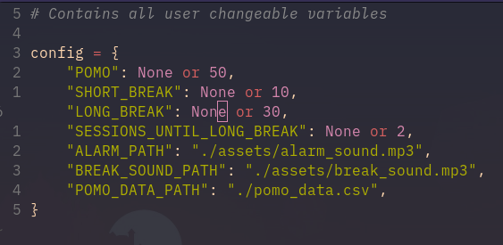
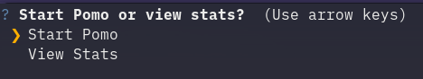
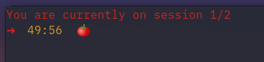
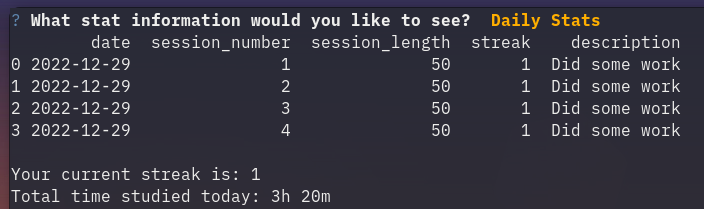

<h1 align='center'>🍅 Pomodoro Cli</h1>

<h4 align='center'>A simple command line solution on using the Pomodoro technique.</h4>

<br>




<!-- ABOUT THE PROJECT -->
## About The Project

This is my solution to a command line pomodoro timer. However, I sought to combine the [pomodoro technique](https://en.wikipedia.org/wiki/Pomodoro_Technique) with data science to track:
1. Amount of hours studied (time tracked after each successful pomodoro)
2. Streaks (streaks update per day on using the app)
3. Overall stats like max amount of hours studied for the day, mean, etc. There's even a line chart you can create! 

These stats are displayed using **Numpy** and **MatPlotLib**.

### Built With

- This project was built purely with **Python**.
- Data is stored inside a `.csv` file. (Default = `pomo_data.csv`)
- Some python packages used to create this:
   1. Numpy + Matplotlib: for displaying stats
   2. Colorama: to prettify the text
   3. playsound: play the alarm and break sound


<!-- GETTING STARTED -->
## Getting Started

The following instructions will help you get set up locally. Don't hesitate to message me if you have any problems!

### Prerequisites

- [python 3](https://www.python.org/downloads/)
- The [python installer package installer](https://pip.pypa.io/en/stable/installation/): `pip` (used to install required dependencies)
```sh
python -m ensurepip --upgrade
```

### Installation

1. Clone the repo
```sh
git clone git@github.com:dave-cao/Pomodoro-Cli.git
```
3. Install pip packages
```sh
pip install -r requirements.txt
```

<!-- USAGE EXAMPLES -->
## Usage

1. Go into the `config.py` file and configure the settings to your liking. The default is a 50 minute pomodoro with 10 minute short breaks and a 30 minute long break. File paths can also be configured here.



2. Run the application
```sh
python3 main.py
```





3. Exit application
```
ctl + c
```

_For a more comprehensive example of using this application, refer to this [video](example_video_here)_


<!-- ROADMAP -->
## Roadmap

Currently, this is the final product. However, I am using this as my daily pomodoro timer, so I may tweak a few things as I see fit.


<!-- CONTRIBUTING -->
## Contributing

Contributions are what make the open source community such an amazing place to learn, inspire, and create. Any contributions you make are **greatly appreciated**.

If you have a suggestion that would make this better, please fork the repo and create a pull request. You can also simply open an issue with the tag "enhancement".
Don't forget to give the project a star! Thanks again!

1. Fork the Project
2. Create your Feature Branch (`git checkout -b feature/AmazingFeature`)
3. Commit your Changes (`git commit -m 'Add some AmazingFeature'`)
4. Push to the Branch (`git push origin feature/AmazingFeature`)
5. Open a Pull Request


<!-- CONTACT -->
## Contact

#### David Cao
- Email: sirdavidcao@gmail.com
- [Youtube](https://www.youtube.com/channel/UCEnBPbnNnqhQIIhW1uLXrLA)
- [Linkedin](https://www.linkedin.com/in/david-cao99/)
- Project Link - https://github.com/dave-cao/Pomodoro-Cli


